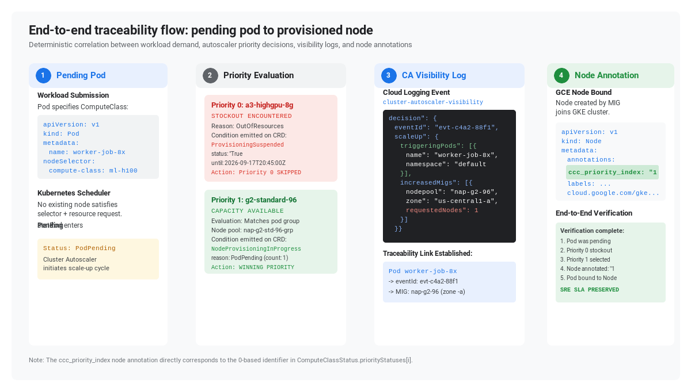
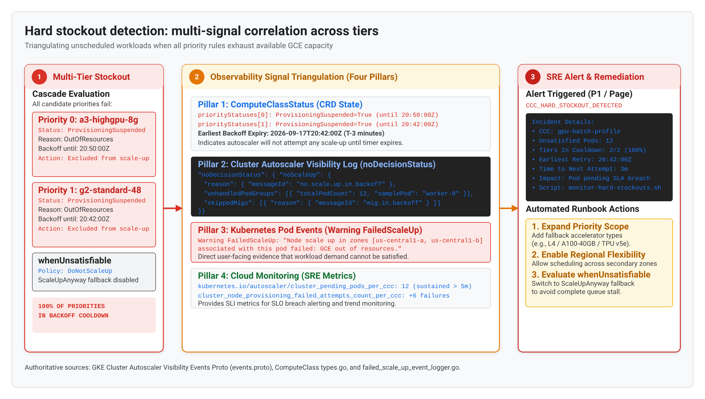

# Observability and traceability for GKE ComputeClasses

This example demonstrates how to monitor, trace, and troubleshoot multi-priority ComputeClass provisioning in GKE `1.36.4-gke.1391000+`.

When running multi-tier priority ladders across Spot and On-Demand instances, platform administrators and application teams need clear answers to three operational questions:
1. Which priority tier actually provisioned the nodes supporting my workload?
2. Did any priority rule experience a zonal or regional capacity stockout, and when does the backoff cooldown expire?
3. If pods remain Pending, did the autoscaler hit a hard stockout across all candidate tiers?

---

## Example manifests

The configuration in this folder defines a cost-effective, multi-tier ladder:
- [observability-class.yaml](./observability-class.yaml): A ComputeClass with three explicit priorities:
  - **Priority 0 (`identifier: "0"`)**: Spot `n4-standard-8` (primary, cost-optimized).
  - **Priority 1 (`identifier: "1"`)**: On-Demand `n4-standard-8` (secondary, reliable same-family fallback).
  - **Priority 2 (`identifier: "2"`)**: On-Demand `c4-standard-8` (tertiary, cross-family compute-optimized fallback).
  - `whenUnsatisfiable: DoNotScaleUp`: Fails predictably when all priorities are exhausted instead of silently launching unapproved default machine types.
- [observability-deploy.yaml](./observability-deploy.yaml): A sample Deployment requesting `cloud.google.com/compute-class: observability-class`.
- [scripts/trace-pod-scaleup.sh](./scripts/trace-pod-scaleup.sh): Helper script to trace the path from a pending pod to its allocated node.
- [scripts/monitor-hard-stockouts.sh](./scripts/monitor-hard-stockouts.sh): Helper script to monitor stockout events and backoff timers.
- [scripts/verify-minimum-capacity.sh](./scripts/verify-minimum-capacity.sh): Helper script to audit proactive minimumCapacity floor fulfillment and shortfall events.

---

## Live status inspection and priority mapping

Starting with GKE `1.36.4-gke.1391000+`, the `ComputeClass` custom resource reports granular health, utilization, and backoff states per priority tier under `status.priorityStatuses[]`.

### Mapping `spec.priorities` to `status.priorityStatuses`

Each entry in `status.priorityStatuses[]` carries an `identifier` field:
- For configured priority rules, `identifier` corresponds to the 0-based index in `spec.priorities` (`"0"`, `"1"`, `"2"`, etc.).
- When `whenUnsatisfiable: ScaleUpAnyway` is configured on the ComputeClass, GKE appends **two** additional entries, not one:
  - An implicit **numeric** rung whose identifier is one past the last index of `spec.priorities` (on a class with a single rule, that is `identifier: "1"`). This rung carries the generic fallback's provisioning conditions, such as `NodeProvisioningInProgress`.
  - A synthetic entry with `identifier: "ScaleUpAnyway"`, which in practice is observed with an empty `conditions` list.

  Because of this, **do not dereference `spec.priorities[<identifier>]` directly** — under `ScaleUpAnyway` a numeric identifier can index past the end of the array. Treat any numeric identifier `>= len(spec.priorities)` as the generic fallback rung.

You can inspect the live status using `kubectl`:

```bash
kubectl get computeclass observability-class -o jsonpath='{range .status.priorityStatuses[*]}Priority [{.identifier}]:{"\n"}{range .conditions[*]}  - Condition: {.type}={.status} ({.message}){"\n"}{end}{end}'
```

Example status output during normal operation:

```yaml
status:
  conditions:
  - type: Health
    status: "True"
    reason: Health
    message: Crd is healthy.
    lastTransitionTime: "2026-09-18T17:02:57Z"
  priorityStatuses:
  - identifier: "0"
    conditions: []
    resourceInfo:
    - name: cpu
      unit: Cores
      currentCount: 2
      targetCount: 2
      currentUtilizationPercentage: 16
      measuredAt: "2026-09-18T17:06:52Z"
    - name: memory
      unit: GiB
      currentCount: 6
      targetCount: 6
      currentUtilizationPercentage: 11
      measuredAt: "2026-09-18T17:06:52Z"
    scalingEventsHistory:
      provisionedNodesCount: 1
      consolidatedNodesCount: 0
      migratedNodesCount: 0
      measuredSince: "2026-09-18T17:03:06Z"
      measuredAt: "2026-09-18T17:06:52Z"
  - identifier: "1"
    conditions: []
    resourceInfo: []
```

---

## Provisioning suspended versus provisioning constrained

When GCE encounters capacity constraints, quota exhaustion, or stockouts, GKE sets specific condition types under the affected `status.priorityStatuses[]` entry. Understanding the distinction between these conditions is essential for capacity management:

| Condition type | Severity | Scope | Meaning and autoscaler behavior |
|---|---|---|---|
| `ProvisioningSuspended` | High | Entire priority tier | The priority tier is completely backed off across all configured zones. The autoscaler will not attempt to scale up this rule until the backoff timer expires. Message format: `NodeProvisioning associated with this priority failed due to the <Reason> error. Backing off the priority until YYYY-MM-DD HH:MM:SS UTC.` |
| `ProvisioningConstrained` | High / Medium | Zonal / NodePool | Node pools associated with this priority failed scale-up in specific zones and entered backoff cooldown. Message format: `NodeProvisioning of the node pools associated with this priority failed due to the <Reason> error. In backoff until YYYY-MM-DD HH:MM:SS UTC.` |
| `NodeProvisioningInProgress` | Informational | Priority tier | The autoscaler has requested new instances from GCE for this priority tier (`reason: PodPending`, message includes `{NodePool: <pool>, MachineType: <type>, Zones: <zone>}`). Cleared automatically once nodes join as Ready. |
| `MinCapacityProvisioning` | Informational | Priority tier | Proactive `minimumCapacity.targetNodeCount` node provisioning has started (`reason: ProvisioningStarted`). |
| `MinCapacityProvisioned` | Informational | Priority tier | Tracks proactive `minimumCapacity.targetNodeCount` fulfillment (`status: "False", reason: ProvisioningInProgress` during scale-up; `status: "True", reason: ProvisioningComplete` once floor is satisfied). |
| `RuleMisconfigured` | High | Priority tier | The priority configuration contains contradictory or unsupported parameters (such as invalid sysctls, missing accelerator drivers, or a machine type unavailable in the auto-provisioned zones). |

### Class-level conditions

In addition to the per-priority conditions above, the top-level `status.conditions[]` array reports the health of the ComputeClass as a whole:

| Condition type | Meaning |
|---|---|
| `Health` | Overall object health. `status: "True"` with `message: Crd is healthy.` in steady state; flips to `status: "False"` with `message: Crd is not healthy.` when any rule is invalid. |
| `CrdMisconfigured` | At least one priority rule is invalid. Carries a specific `reason` (for example `UnavailableMachineType`) and a message naming the offending machine type and the zone that was checked. |
| `UnableToProvision` | Every declared priority is unable to provision and `whenUnsatisfiable: ScaleUpAnyway` is not in effect. |

`Health` is the single most useful field to alert on, because it is one boolean covering every rule in the ladder:

```bash
kubectl get computeclass observability-class -o json | jq -r '
  .status.conditions[]? | select(.type=="Health") | "Health=\(.status) (\(.message))"
'
```

### Viewing active backoff timers

To check if any priority tier is currently suspended or constrained due to stockouts or quota limits:

```bash
kubectl get computeclass observability-class -o json | jq -r '
  .status.priorityStatuses[] as $p |
  $p.conditions[]? |
  select((.type == "ProvisioningSuspended" or .type == "ProvisioningConstrained") and .status == "True") |
  "Priority \($p.identifier) [\(.type)]: \(.message)"
'
```

---

## Node placement verification via annotations

When GKE provisions a node pool via node auto-provisioning for a ComputeClass, it tags the node with two immutable metadata elements:
1. Label: `cloud.google.com/compute-class: <compute-class-name>`
2. Annotation: `ccc_priority_index: "<value>"`

### Annotation values contract

The `ccc_priority_index` annotation contract defines the exact mechanism that created the node:

| Annotation value | Classification | Description |
|---|---|---|
| `"0"`, `"1"`, `"2"`, etc. | Primary / Fallback Tier | The node was provisioned by the corresponding 0-based rule in `spec.priorities`. |
| `"ccc_scale_up_anyway"` | Generic Fallback | All defined priorities failed, and GKE provisioned a default node (typically `e2`) because `whenUnsatisfiable: ScaleUpAnyway` was enabled. |
| `"ccc_no_rule_matching"` | Configuration Drift / Unmatched Pool | The ComputeClass still exists, but no rule in it currently matches this node. This includes the drift case where the priority rule that originally created the node was **removed from `spec.priorities`**, as well as nodes in unmanaged pools. |
| `"ccc_deleted"` | Orphaned Node | **The ComputeClass object itself has been deleted**, and the node it provisioned has outlived it. |

> **Note on drift detection:** editing a rule out of `spec.priorities` moves affected nodes to `ccc_no_rule_matching`, *not* `ccc_deleted`. `ccc_deleted` is reserved for nodes whose entire ComputeClass object is gone. Verified on GKE `1.36.4-gke.1391000`.

### Querying node placement across the cluster

To inspect all nodes running under ComputeClasses and their provisioned priority tiers:

```bash
kubectl get nodes \
  -o custom-columns=NAME:.metadata.name,CCC:.metadata.labels.cloud\.google\.com/compute-class,PRIORITY_INDEX:.metadata.annotations.ccc_priority_index,ZONE:.metadata.labels.topology\.kubernetes\.io/zone,TYPE:.metadata.labels.node\.kubernetes\.io/instance-type
```

Example output:

```
NAME                                       CCC                   PRIORITY_INDEX  ZONE           TYPE
gke-demo-nap-n4-standard-8-spot-a1b2c3    observability-class   0               us-central1-a  n4-standard-8
gke-demo-nap-n4-standard-8-spot-d4e5f6    observability-class   0               us-central1-b  n4-standard-8
gke-demo-nap-n4-standard-8-od-987654      observability-class   1               us-central1-a  n4-standard-8
```

In this output, pods placed on `gke-demo-nap-n4-standard-8-od-987654` are running on Priority 1 (On-Demand), indicating that Priority 0 (Spot) was unavailable at the time of scale-up.

---

## End-to-end traceability workflow

To trace a workload from creation to node placement, follow this step-by-step workflow:

```
[Pending Pod] -> [CA Visibility decision.scaleUp] -> [ComputeClass Status] -> [Node ccc_priority_index]
```



1. **Pending pod creation**:
   A workload is deployed with `nodeSelector: cloud.google.com/compute-class: observability-class`. Because no existing node has sufficient spare capacity, the pod enters `Pending`.
2. **Cluster Autoscaler evaluation**:
   The autoscaler evaluates candidate node pools corresponding to `spec.priorities[0]` (Spot `n4-standard-8`).
   - If capacity is available, GCE provisions the instance group.
   - If Spot stockout occurs, the autoscaler attempts `spec.priorities[1]` (On-Demand `n4-standard-8`).
   - If both fail, it attempts `spec.priorities[2]` (On-Demand `c4-standard-8`).
3. **Visibility log emission**:
   The autoscaler logs a `decision.scaleUp` event to Google Cloud Logging under `log_id("container.googleapis.com/cluster-autoscaler-visibility")`.
4. **Status update**:
   The ComputeClass controller updates `status.priorityStatuses[]`. If Priority 0 failed, it records `ProvisioningSuspended: True` or `ProvisioningConstrained: True` for identifier `"0"`.
5. **Node registration**:
   When the node joins the cluster, the node auto-provisioning controller sets `metadata.annotations.ccc_priority_index: "1"` (or `"0"` / `"2"`).
6. **Workload scheduling**:
   kube-scheduler schedules the pending pod onto the newly created node.

You can automate this entire inspection with the included script:

```bash
./scripts/trace-pod-scaleup.sh \
  --pod <pod-name> \
  --namespace default \
  --project <project-id> \
  --cluster <cluster-name> \
  [--context <kube-context>]
```

---

## Hard stockout detection workflow



A **hard stockout** occurs when all candidate priority tiers in a ComputeClass fail to provision capacity or enter backoff cooldown simultaneously.

### Symptoms of a hard stockout

When a hard stockout occurs:
1. Pods remain stuck in `Pending` phase indefinitely.
2. Pod events record a `Warning FailedScaleUp`:
   ```
   Warning  FailedScaleUp  pod didn't trigger scale-up: 3 max node group size reached, 1 GCE out of resources
   ```

   > **Caution:** pod events are not a reliable diagnosis of *why* the ladder failed. When a priority rule is misconfigured (for example, a machine type unavailable in the region), the autoscaler reports the last predicate that failed against **existing** nodes, producing a misleading event such as:
   >
   > ```
   > Warning  NotTriggerScaleUp  pod didn't trigger scale-up: 8 node(s) had untolerated taint(s)
   > ```
   >
   > Taints are unrelated to the actual failure. Always confirm the cause against `status.conditions[]` and `status.priorityStatuses[].conditions[]` on the ComputeClass rather than the pod event.
3. The ComputeClass status shows `ProvisioningSuspended: True` across multiple priority identifiers.
4. Cluster Autoscaler Visibility logs emit `noDecisionStatus.noScaleUp`:
   ```json
   {
     "noDecisionStatus": {
       "noScaleUp": {
         "unhandledPodGroups": [
           {
             "napFailureReasons": [
               {
                 "messageId": "scale.up.error.out.of.resources",
                 "parameters": ["n4-standard-8", "us-central1-a"]
               }
             ]
           }
         ]
       }
     }
   }
   ```

### Detection query

To query Cloud Logging for hard stockout visibility events across the cluster:

```bash
gcloud logging read '
  log_id("container.googleapis.com/cluster-autoscaler-visibility")
  AND (jsonPayload.resultInfo.results.error.messageId="scale.up.error.out.of.resources"
       OR jsonPayload.noDecisionStatus.noScaleUp:*)
' --limit=20 --format="table(timestamp,jsonPayload.trigger,jsonPayload.resultInfo.results[0].error.messageId)"
```

### Cloud Monitoring metrics & MQL queries (1.36+)

GKE exports three ComputeClass autoscaling metrics under the `k8s_entity` monitored resource (`resource.labels.entity_type = "ComputeClass"`):
- `kubernetes.io/autoscaler/cluster_pending_pods_per_ccc`: Pending Pods awaiting provisioning (or in `UnableToProvision` state). Filter `resource.labels.entity_name = ""` to isolate non-ComputeClass pods.
- `kubernetes.io/autoscaler/cluster_node_provisioning_attempts_count_per_ccc`: Scale-up attempts initiated per ComputeClass.
  - **Asynchronous provisioning rule**: Do not subtract failures from attempts in real time to calculate successes; compare trends over a rolling window (e.g., `rate(10m)`).
- `kubernetes.io/autoscaler/cluster_node_provisioning_failed_attempts_count_per_ccc`: Failed scale-up attempts categorized by `metric.labels.reason`.

#### Top failure reasons per ComputeClass (MQL)
```text
fetch k8s_entity
| metric 'kubernetes.io/autoscaler/cluster_node_provisioning_failed_attempts_count_per_ccc'
| filter resource.entity_type == 'ComputeClass'
| align rate(1h)
| group_by [metric.reason, resource.entity_name], sum(val())
```

The `metric.labels.reason` label reports 15 official failure codes:
- **Capacity & Quota**: `RESOURCE_POOL_EXHAUSTED` (maps to `OutOfResources` in CRD status), `QUOTA_EXCEEDED`, `IP_SPACE_EXHAUSTED` (node subnet primary IP or secondary Pod alias CIDR full).
- **IAM & Policy**: `PERMISSIONS_ERROR`, `VM_EXTERNAL_IP_ACCESS_POLICY_CONSTRAINT`.
- **Reservations & TPUs**: `INVALID_RESERVATION`, `RESERVATION_NOT_FOUND`, `RESERVATION_NOT_READY`, `RESERVATION_CAPACITY_EXCEEDED`, `RESERVATION_INCOMPATIBLE`, `AUTOMATIC_RESERVATIONS_NOT_AVAILABLE`, `AUTOMATIC_RESERVATIONS_NO_CAPACITY`, `UNSUPPORTED_TPU_CONFIGURATION`.
- **Control Plane & Catch-all**: `GkePersistentOperationError`, `OTHER`.

### Historical status inspection via Cloud Audit Logs

Because `kubectl get computeclass` only reflects current state and Kubernetes Pod events expire after 60 minutes, inspect historical status transitions and deleted node annotations across clusters in Cloud Audit Logs:

```text
# 1. Inspect historical priority suspension & resourceInfo snapshots
resource.type="k8s_cluster"
protoPayload.resourceName:"cloud.google.com/v1/computeclasses/COMPUTECLASS_NAME"
protoPayload.methodName:"com.google.cloud.v1.computeclasses.status"

# 2. Verify ccc_priority_index on nodes that have already been scaled down/deleted
resource.type="k8s_cluster"
protoPayload.methodName=("io.k8s.core.v1.nodes.patch" OR "io.k8s.core.v1.nodes.update")
protoPayload.resourceName:"nodes/NODE_NAME"
```
Expand `protoPayload.request.status` in `computeclasses.status` logs to examine historical `priorityStatuses[].conditions`, `resourceInfo` (`targetCount > currentCount` for scale-up vs. `< currentCount` for scale-down), and `scalingEventsHistory` (`provisionedNodesCount` vs. `consolidatedNodesCount`). For the node annotation, inspect `protoPayload.request.metadata.annotations["ccc_priority_index"]` — but note it is **not** present on `nodes.create`. GKE writes the annotation roughly a minute *after* the node object is created, as a separate patch, so the create entry shows the node without it. Filter on `nodes.patch`/`nodes.update` as above. Because both a patch and an update can carry the same annotation write, count nodes by `protoPayload.resourceName` rather than by entry if you are tallying provisions.

Run the automated diagnostic script to inspect your ComputeClass in real time:

```bash
./scripts/monitor-hard-stockouts.sh \
  --ccc observability-class \
  --project <project-id> \
  --cluster <cluster-name> \
  [--context <kube-context>]
```

---

## Use case 3: Active migration and config drift rollout stalls

When updating a ComputeClass specification or enabling `spec.activeMigration` to rebalance workloads back to Priority 0 after a stockout clears, node replacement can stall silently due to restrictive PodDisruptionBudgets (PDBs) or `safe-to-evict: false` annotations.

There is **no dedicated migration or config-drift object in `status`**. The `ComputeClass` status tree contains only `conditions`, `priorityStatuses`, and `resourceInfo`. Diagnose migration stalls by combining the fields that do exist:

1. **Distinguish migration from churn.** Compare `scalingEventsHistory.migratedNodesCount` against `consolidatedNodesCount` per priority to separate planned active migration from Spot preemption or low-utilization scale-down:
   ```bash
   kubectl get computeclass observability-class -o json | jq -r '
     .status.priorityStatuses[] |
     "Priority \(.identifier): migrated=\(.scalingEventsHistory.migratedNodesCount // 0) consolidated=\(.scalingEventsHistory.consolidatedNodesCount // 0) provisioned=\(.scalingEventsHistory.provisionedNodesCount // 0)"
   '
   ```
2. **Find nodes stranded on a removed rule.** Nodes whose originating rule was edited out of `spec.priorities` carry `ccc_priority_index: ccc_no_rule_matching`:
   ```bash
   kubectl get nodes -o json | jq -r '
     .items[] | select(.metadata.annotations."ccc_priority_index" == "ccc_no_rule_matching") |
     .metadata.name
   '
   ```
3. **Confirm the target rung can actually absorb the migration.** If Priority 0 is in backoff or misconfigured, migration has nowhere to land — check its `conditions[]` using the backoff query above.
4. **Identify eviction blockers.** PDBs and `safe-to-evict: false` annotations are not reported on the ComputeClass. Use Cluster Autoscaler visibility logs (`noDecisionStatus.noScaleDown`) and `kubectl get pdb -A` to find what is pinning the node.

---

## Use case 4: Reservation realization and spillover forensics

To verify that workloads consumed paid GCE capacity reservations (`reservations.affinity: AnyBestEffort` / `Specific`) rather than spilling over to unreserved On-Demand capacity:
1. Check `status.priorityStatuses[0].conditions[]` (live or in Cloud Audit Logs) for `ReservationCapacityExceeded`, `ReservationNotFound`, `ReservationNotReady`, or `ReservationIncompatible`.
2. Compare `resourceInfo` counts on Priority `"0"` (Reserved) vs. Priority `"1"` (Unreserved On-Demand fallback) to quantify spillover. Note that `resourceInfo` is an **array** of named resources, not a map, so select into it rather than keying into it: `.resourceInfo[] | select(.name=="cpu") | .currentCount`.
3. Monitor `cluster_node_provisioning_failed_attempts_count_per_ccc` filtered by `metric.labels.reason =~ "RESERVATION_.*|AUTOMATIC_RESERVATIONS_.*"`.

---

## Use case 5: Proactive minimumCapacity verification and shortfall diagnostics

When `minimumCapacity.targetNodeCount` is configured at the class level (`spec.minimumCapacity.targetNodeCount`) or per-priority level (`spec.priorities[].minimumCapacity.targetNodeCount`), Cluster Autoscaler proactively provisions baseline capacity even when **0 user pods** are pending.

Because no user pods are pending during proactive pre-warming, operators cannot rely on `kubectl get pods` or workload pod `FailedScaleUp` events when capacity falls short (for example, when a GCE reservation block has only 1 VM left or a TPU/GPU slice has a degraded host). Additionally, Cluster Autoscaler logs `no.scale.down.node.no.place.to.move.pods` on nodes holding `minimumCapacity` floors—which is expected floor protection (Working As Intended) rather than a scale-down failure.

Use `scripts/verify-minimum-capacity.sh` to audit proactive floor fulfillment, per-priority and per-reservation node counts, proactive scale-up shortfall reasons, and expected scale-down floor protection.

---

## Automation helper scripts

This example includes three zero-dependency (`bash` + `jq`) diagnostic shell scripts in `./scripts`. All scripts support dual evaluation modes:
- **CRD Status Mode (`1.36.4-gke.1391000+` with Enhanced Observability active)**: Reads `status.priorityStatuses[]` directly from the `ComputeClass` API object.
- **Pre-Rollout Live Inference Mode**: On clusters where `status.priorityStatuses[]` is not yet active on the control plane, the scripts automatically correlate `spec.priorities` against live Cluster Autoscaler Visibility logs (`decision.scaleUp` / `noDecisionStatus.noScaleUp`), Node attributes (`node.kubernetes.io/instance-type`, `cloud.google.com/gke-spot`), and Kubernetes Pod Warning events (`FailedScaleUp` / `NotTriggerScaleUp`) scoped strictly to pods targeting the ComputeClass.

### `trace-pod-scaleup.sh`
Performs live end-to-end scale-up traceability across:
- Pod phase, bound node, and `nodeSelector`.
- Cluster Autoscaler visibility decisions (`decision.scaleUp.triggeringPods` and `increasedMigs`).
- Skipped higher priority rules and winning priority rule identification.
- Node labels and `ccc_priority_index` annotation verification.

```bash
./scripts/trace-pod-scaleup.sh \
  --pod observability-workload-7848bdc47c-x89jk \
  --namespace default \
  --project my-gcp-project \
  --cluster my-gke-cluster \
  [--context my-kube-context]
```

### `monitor-hard-stockouts.sh`
Performs targeted stockout detection and runbook generation across:
- Priority rules in `ProvisioningSuspended` / `RuleMisconfigured` (or live-inferred unsatisfiable priorities).
- Unhandled pod groups from Cloud Logging (`noDecisionStatus.noScaleUp.unhandledPodGroups`) scoped to the ComputeClass.
- Pending pods with `FailedScaleUp` or `NotTriggerScaleUp` Kubernetes Warning events.

```bash
./scripts/monitor-hard-stockouts.sh \
  --ccc observability-class \
  --project my-gcp-project \
  --cluster my-gke-cluster \
  [--context my-kube-context]
```

### `verify-minimum-capacity.sh`
Audits declarative `minimumCapacity.targetNodeCount` fulfillment across:
- Effective target floor calculation (`max(spec.minimumCapacity.targetNodeCount, sum(priorities[].minimumCapacity.targetNodeCount))`).
- Live Ready node accounting broken down by Priority Tier and GCE Reservation block (`cloud.google.com/reservation-name`).
- Proactive scale-up decisions (`decision.scaleUp`) and shortfall root causes (`noDecisionStatus.noScaleUp.unhandledPodGroups`).
- Identification of `no.scale.down.node.no.place.to.move.pods` events as expected `minimumCapacity` floor protection (Working As Intended) and detection of orphaned nodes (`ccc_priority_index=ccc_deleted`).

```bash
./scripts/verify-minimum-capacity.sh \
  --ccc observability-class \
  --project my-gcp-project \
  --cluster my-gke-cluster \
  [--context my-kube-context] \
  [--json]
```

---

## Validation instructions

To validate this example on a live GKE cluster:

1. Apply the ComputeClass:
   ```bash
   kubectl apply -f observability-class.yaml
   ```
2. Verify the ComputeClass CRD accepted the configuration:
   ```bash
   kubectl describe computeclass observability-class
   ```
3. Run server-side dry-run validation on the sample workload:
   ```bash
   kubectl apply -f observability-deploy.yaml --dry-run=server
   ```
4. Clean up the ComputeClass when validation is complete:
   ```bash
   kubectl delete -f observability-class.yaml
   ```
