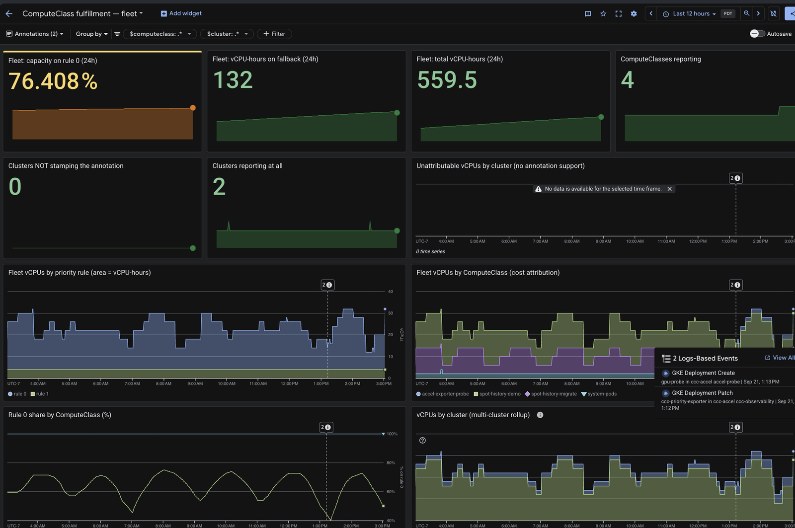

# Priority-rule fulfillment: how often did rule 0 actually win?

A ComputeClass states a preference; `kubectl get computeclass` shows only what is true right now. This example exports the `ccc_priority_index` node annotation as Prometheus metrics so you can answer the historical question instead: **over the last week, how much of the capacity this class delivered came from your first-choice rule, and how much came from fallbacks?**



## Prerequisites

- **GKE 1.33+**, which is where nodes start carrying the `ccc_priority_index` annotation the exporter reads. Check your cluster — the key is bare `ccc_priority_index`, with **no `cloud.google.com/` prefix**:

  ```bash
  kubectl get nodes -o json | python3 -c "import json,sys
  for n in json.load(sys.stdin)['items']:
      a = n['metadata'].get('annotations', {})
      print(n['metadata']['name'], a.get('ccc_priority_index', '<absent>'))"
  ```

- **Managed Service for Prometheus** enabled (default on Autopilot and recent Standard clusters).
- **`roles/monitoring.dashboardEditor`** on the project.

No image build or registry: the exporter script is mounted from a ConfigMap into a stock `python:3.12-slim` image.

## What this example shows

[`exporter.yaml`](./exporter.yaml) deploys a namespace, a ServiceAccount, a ClusterRole granting **read-only access to nodes and nothing else**, the script in a ConfigMap, a Deployment, and a `PodMonitoring` scraping every 30s. It polls nodes every 10s and, for each one labelled `cloud.google.com/compute-class`, emits:

| Metric | Type | Meaning |
|---|---|---|
| `ccc_vcpus_by_priority` | gauge | vCPUs running on each rule. Area under a stacked plot = vCPU-hours. |
| `ccc_accelerators_by_priority` | gauge | Chips per rule, labelled `accelerator` (`nvidia.com/gpu`, `google.com/tpu`). Absent on CPU-only fleets. |
| `ccc_node_provisions_total` | counter | Nodes provisioned per rule, deduplicated by node UID. |
| `ccc_nodes_by_priority` | gauge | Raw node count per rule. |
| `ccc_exporter_up` | gauge | 1 when the last poll succeeded. |
| `ccc_priority_annotation_supported` | gauge | 1 if this cluster stamps the annotation, 0 if not, absent if no node is old enough to say. |

vCPU-time is the headline unit because node count misleads as soon as rules provision different shapes — a class falling back from `c3` to `e2` can show a 50/50 node split while the fallback carries most of the compute. On accelerator classes the chip count is what you rank rules over, so `ccc_accelerators_by_priority` is tracked separately.

Every series carries `computeclass`, `priority` and `kind`. `kind` is one of `rule` (a numeric index), `sentinel` (`ccc_scale_up_anyway`, `ccc_no_rule_matching`, `ccc_deleted`), `pending` (the annotation lands ~1 min after the node, so young unannotated nodes wait here), or `unsupported` (past the 300s grace window — this cluster does not stamp it at all). Share queries filter to `kind="rule"`, so an unsupported cluster contributes to neither numerator nor denominator.

GMP stamps `cluster`, `location` and `project_id` on every series, so multiple clusters roll up with `sum by (cluster)` — just deploy the same `exporter.yaml` to each. For clusters in different projects, point the dashboard at a [metrics scope](https://cloud.google.com/monitoring/settings) that includes them.

### The dashboards

| File | Scope |
|---|---|
| [`dashboard.json`](./dashboard.json) | One ComputeClass in detail, with separate vCPU, GPU-chip and TPU-chip charts. The debugging view. |
| [`dashboard-fleet.json`](./dashboard-fleet.json) | Every class and cluster, by **vCPU**. Per-class cost attribution and rule-0 share. |
| [`dashboard-fleet-gpu.json`](./dashboard-fleet-gpu.json) | The same, by **GPU chip**. |
| [`dashboard-fleet-tpu.json`](./dashboard-fleet-tpu.json) | The same, by **TPU chip**. |
| [`dashboard-health.json`](./dashboard-health.json) | Scale-up health for one cluster right now: unschedulable pods, provisions per rule, fallback pressure. |

The three fleet dashboards ask identical questions of different units, so only the vCPU one is hand-written; [`make-fleet-variants.py`](./make-fleet-variants.py) generates the other two (`--check` fails if they are stale). Both fleet dashboards default their `computeclass` and `cluster` variables to `.*`, so they open fleet-wide.

## Deploy

```bash
kubectl apply -f exporter.yaml
kubectl -n ccc-observability rollout status deploy/ccc-priority-exporter
```

## Install the dashboards

```bash
./install-dashboards.sh                  # active gcloud project
./install-dashboards.sh my-project       # explicit project
./install-dashboards.sh --update         # replace dashboards already installed
./install-dashboards.sh --validate-only  # parse and validate, create nothing
./install-dashboards.sh --all            # include accelerator variants with no data yet
```

The script checks that the metrics are arriving, creates whichever dashboards are missing, and prints a bookmark-ready URL for each. Re-running is safe: an existing dashboard (matched by display name) is left alone unless you pass `--update`. GPU and TPU variants are skipped when the project reports no chips of that kind, since an all-blank dashboard looks identical to a broken exporter.

The JSON carries no project, cluster or ComputeClass names, so it installs unchanged anywhere. Two things to know if you edit it:

- Use `${computeclass.value}` inside an explicit `=~"..."` matcher, **not** bare `${computeclass}`. The bare form expands to a whole matcher using `=`, so a `.*` default silently becomes `computeclass=".*"` and matches nothing — an empty chart rather than an error.
- `gcloud monitoring dashboards update` requires an `etag`, which these files deliberately omit (an etag pins the JSON to one installed copy). The script reads the live etag and splices it in; by hand, delete and recreate.

Cloud Monitoring has no dashboard-level default time range — it lives in the URL, and the console defaults to 1 hour:

```
https://console.cloud.google.com/monitoring/dashboards/builder/<dashboard-id>;duration=PT24H?project=<project-id>
```

`duration` takes an ISO-8601 period: `PT1H`, `PT6H`, `PT24H`, `P7D`.

## Observe

Generate traffic across more than one rule:

```bash
kubectl apply -f priority-fulfillment-class.yaml
kubectl apply -f priority-fulfillment-deploy.yaml
kubectl scale deploy/priority-fulfillment-load --replicas=8
```

Allow a few minutes for nodes to provision, the annotation to land, and GMP to ingest a scrape or two.

### 1. Check the annotation per node

```bash
kubectl get nodes \
  -L cloud.google.com/compute-class \
  -o custom-columns='NODE:.metadata.name,PRIORITY:.metadata.annotations.ccc_priority_index,TYPE:.metadata.labels.node\.kubernetes\.io/instance-type'
```

### 2. Query the fulfillment rate directly

```promql
# Share of attributable vCPU-time served by rule 0 over 24h.
# A ratio of sum_over_time, so the scrape interval cancels out.
100 * sum(sum_over_time(ccc_vcpus_by_priority{computeclass="priority-fulfillment",kind="rule",priority="0"}[24h]))
    / sum(sum_over_time(ccc_vcpus_by_priority{computeclass="priority-fulfillment",kind="rule"}[24h]))

# vCPU-hours per rule. Each sample covers 30s, so /120 converts samples to hours.
sum by (priority) (sum_over_time(ccc_vcpus_by_priority{computeclass="priority-fulfillment",kind="rule"}[24h])) / 120
```

The `/120` is tied to the 30s scrape interval in `exporter.yaml`. If you change `PodMonitoring.spec.endpoints[].interval`, use `3600 / <interval seconds>`.

### 3. Read the charts

A healthy class is a solid band of rule 0 with thin slivers above it.

- **A persistent fallback band** — your first-choice shape is not reliably available in that region. Either the preference is aspirational, or the rule needs more zones.
- **A fallback band at the same time each day** — contention rather than scarcity; usually argues for a reservation.
- **Anything in the sentinel tile** — `ccc_no_rule_matching` means nodes matched none of your rules; `ccc_scale_up_anyway` means every rule was exhausted. Both mean the class is not describing reality.
- **A wide `pending_annotation` band** is normal during bursts and should drain within a minute. If it does not, check `ccc_exporter_up`.

## Caveats

- **`priorityScore` inverts what "rule 0" means.** When a rule carries a `priorityScore`, that score rather than list position decides what GKE tries first, but the annotation still records the **list index**. On a score-ordered class these tiles would report 0% on rule 0 while the class gets its most-preferred shape every time. Use them on list-ordered classes; otherwise read the per-rule chart against your own ordering and ignore the rule-0 scorecard.
- **`ccc_node_provisions_total` under-counts its first cohort.** Managed Prometheus baselines a counter at whatever value it holds on first scrape, so the first nodes on a newly-seen priority are invisible to `increase()`. Read the provisioning tile as a trend, not an audited total; scrape the pod on port 9100 for true counts. The gauge-based tiles are unaffected.
- **The health dashboard needs kube-state-metrics.** Its pending-pod tiles read `kube_pod_status_unschedulable` and end in `or vector(0)`, so without the `POD` package they report a believable zero forever. Enable with `gcloud container clusters update CLUSTER --location LOCATION --monitoring=SYSTEM,POD` (the flag replaces the component set). The installer's preflight checks for this.

## Cleanup

```bash
kubectl delete -f priority-fulfillment-deploy.yaml --ignore-not-found
kubectl delete -f priority-fulfillment-class.yaml --ignore-not-found
kubectl delete -f exporter.yaml --ignore-not-found
```

Node auto-provisioning reclaims the nodes a few minutes later, leaving empty `nap-*` node pool shells behind (harmless). Delete dashboards from the console or with `gcloud monitoring dashboards delete <dashboard-id>`.
